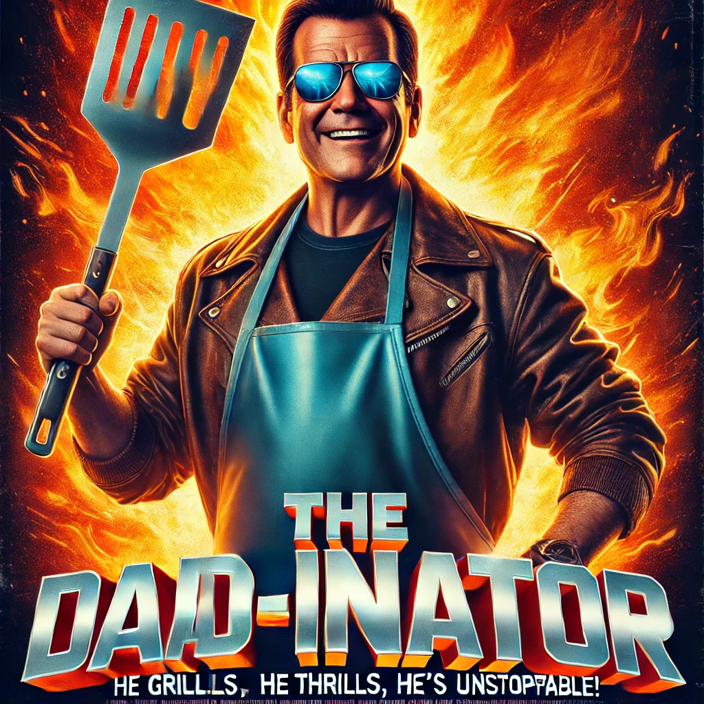

# The Dadinator

The Dadinator is a fun, action-comedy themed Streamlit web application designed to bring joy through dad jokes. With a fiery personality reminiscent of action movie heroes, The Dadinator will have you laughing in no time with the push of a button!



## Features

- **Joke Generator**: With a click of the button, get a randomly generated dad joke from the [icanhazdadjoke API](https://icanhazdadjoke.com/).
- **Streamlit Interface**: Built with [Streamlit](https://streamlit.io/), making it easy to deploy and interact with.
- **Python Powered**: Uses Python for seamless API requests and simple, yet effective UI.

## Getting Started

These instructions will help you get a copy of the project up and running on your local machine for development and testing purposes.

### Prerequisites

Make sure you have Python installed on your system. You can download it [here](https://www.python.org/).

### Installation

1. **Clone the repo**
   ```bash
   git clone https://github.com/baj22/dadinator.git
   ```
2. **Navigate to the project directory**
   ```bash
   cd dadinator
   ```
3. **Install the required packages**
   ```bash
   pip install -r requirements.txt
   ```
4. **Run the Streamlit application**
   ```bash
   streamlit run main.py
   ```

## Usage

After running the application, you will see a web interface with the "The Dadinator" title and an image of the Dad-inator himself. Press the "Make me laugh!" button to receive a randomly generated dad joke.

## Built With

* [![Python][Python-shield]][Python-url]
* [![Streamlit][Streamlit-shield]][Streamlit-url]

[Streamlit-shield]: https://img.shields.io/badge/-Streamlit-FF4B4B?logo=streamlit&logoColor=white
[Streamlit-url]: https://streamlit.io/
[Python-shield]: https://img.shields.io/badge/python-3670A0?logo=python&logoColor=ffdd54
[Python-url]: https://www.python.org/

## License

This project is licensed under the MIT License - see the [LICENSE](LICENSE) file for details.

## Acknowledgments

- Thanks to [icanhazdadjoke](https://icanhazdadjoke.com/) for their awesome dad joke API.
- Inspired by classic action heroes and their one-liners.

---

> **Disclaimer**: The Dadinator takes no responsibility for uncontrollable laughter, groans at cheesy jokes, or any sudden urges to wear leather jackets and grill spatulas.
